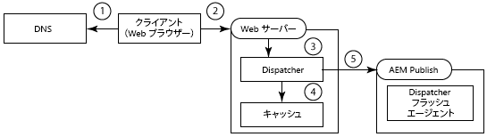

# 複数ドメインでの Dispatcher の使用 {#using-dispatcher-with-multiple-domains}

>[!NOTE]
>
>Dispatcher のバージョンは AEM とは無関係です。AEM または CQ のドキュメントに組み込まれている Dispatcher のドキュメントへのリンクをたどると、このページにリダイレクトされる可能性があります。

Dispatcher を使用すると、以下の条件を満たしつつ、複数の Web ドメインでページ要求を処理できます。

* 両方のドメイン用の Web コンテンツが単一の AEM リポジトリに保存されている。
* Dispatcher キャッシュ内のファイルをドメインごとに個別に無効化できる。

例えば、ある会社がブランド A とブランド B という 2 つのブランドの Web サイトを公開しているとします。Web サイトページのコンテンツは AEM で作成され、次のように同じリポジトリワークスペースに保存されています。

```
/
| - content  
   | - sitea  
       | - content nodes  
   | - siteb  
       | - content nodes
```

以下のページが保存 `BrandA.com``/content/sitea`されています。URL `https://BrandA.com/en.html` に対するクライアントリクエストが `/content/sitea/en` 、ノードのレンダリングされたページを返します。同様に、ページ `BrandB.com` は以下 `/content/siteb`のように格納されます。

Dispatcher を使用してコンテンツをキャッシュする場合は、クライアント HTTP 要求内のページ URL、キャッシュ内の対応するファイルのパスおよびリポジトリ内の対応するファイルのパスの間に関連付けを作成する必要があります。

## クライアント要求

クライアントが HTTP 要求を Web サーバーに送信した場合、要求されたページの URL を Dispatcher キャッシュ内のコンテンツに解決し、最終的にはリポジトリ内のコンテンツに解決する必要があります。



1. ドメインネームシステムが、HTTP 要求内のドメイン名に対して登録されている Web サーバーの IP アドレスを検出します。
1. HTTP 要求が Web サーバーに送信されます。
1. HTTP 要求が Dispatcher に渡されます。
1. Dispatcher が、キャッシュされたファイルが有効かどうか判断します。有効な場合、キャッシュされたファイルがクライアントに返されます。
1. キャッシュされたファイルが有効ではない場合、Dispatcher は AEM パブリッシュインスタンスから新たにレンダリングされたページを要求します。

## キャッシュの無効化

Dispatcher フラッシュレプリケーションエージェントが、キャッシュされたファイルを Dispatcher が無効化するように要求した場合、リポジトリ内のコンテンツのパスをキャッシュ内のコンテンツに解決する必要があります。


1. AEM オーサーインスタンス上でページがアクティベートされ、コンテンツがパブリッシュインスタンスにレプリケートされます。
1. Dispatcher フラッシュエージェントが、レプリケートされたコンテンツのキャッシュを無効化するために Dispatcher を呼び出します。
1. キャッシュされたファイルを無効化するために、Dispatcher が 1 つまたは複数の .stat ファイルにアクセスします。

複数のドメインで Dispatcher を使用するには、AEM、Dispatcher および Web サーバーを設定する必要があります。このページで説明する解決方法は一般的なもので、ほとんどの環境に適用できます。AEMトポロジの複雑さにより、ソリューションには特定の問題を解決するためにさらなるカスタム設定が必要になることがあります。既存のITインフラストラクチャおよび管理ポリシーに適合するようにサンプルを調整する必要があります。

## URL マッピング {#url-mapping}

ドメイン URL とコンテンツパスをキャッシュファイルへと解決するには、プロセスのどこかの時点で、ファイルパスまたはページ URL を変換する必要があります。以下で一般的な戦略を説明しますが、この説明では、プロセスの様々な時点でパスまたは URL の変換をおこないます。

* （推奨）AEM パブリッシュインスタンスが、リソースの解決に Sling マッピングを使用して、内部 URL の書き換えルールを実装する。ドメイン URL はコンテンツリポジトリのパスに変換される（[AEM による受信 URL の書き換え](dispatcher-domains.md#main-pars-title-2)を参照）。
* Web サーバーが、ドメイン URL をキャッシュのパスに変換する内部 URL 書き換えルールを使用する（Webサーバー [での受信URLの書き直しを参照](dispatcher-domains.md#main-pars-title-1)）。

一般的に望ましいのは、Web ページに対して短縮された URL を使用することです。通常、ページ URL は、Web コンテンツが格納されたリポジトリフォルダーの構造をミラーリングしています。ただし、URLには、などの最上位のリポジトリノードが表示されません `/content`。クライアントは、AEMリポジトリの構造を認識していません。

## 一般的な要件 {#general-requirements}

複数のドメインでのディスパッチャーの動作をサポートするために、環境では以下の設定を実装する必要があります。

* 各ドメイン用のコンテンツをリポジトリの別々のブランチに配置する（以下のサンプルの環境を参照）。
* Dispatcher フラッシュレプリケーションエージェントを AEM パブリッシュインスタンス上に設定する（発行インスタンスからのディスパッチャーキャッシュ [の無効化を参照](page-invalidate.md)）。
* ドメインネームシステムが、ドメイン名を Web サーバーの IP アドレスに解決する。
* Dispatcher キャッシュが、AEM コンテンツリポジトリのディレクトリ構造をミラーリングしている。Web サーバーのドキュメントルートの下のファイルパスは、リポジトリ内のファイルのパスと同じである。

## 提供されているサンプルの環境 {#environment-for-the-provided-examples}

提供されている解決方法のサンプルは、以下の特徴を持つ環境に適用されます。

* AEM オーサーインスタンスおよびパブリッシュインスタンスが Linux システム上にデプロイされている。
* Apache HTTPD は Web サーバーで、Linux システム上にデプロイされている。
* AEMコンテンツリポジトリとWebサーバーのドキュメントルートは、次のファイル構造（Apache Webサーバーのドキュメントルート）を使用します`usr/lib/apache/httpd-2.4.3/htdocs)`。

   **リポジトリ**

```
  | - /content  
    | - sitea  
  |    | - content nodes 
    | - siteb  
       | - conent nodes
```

**Web サーバーのドキュメントルート**

```
  | - /usr  
    | - lib  
      | - apache  
        | - httpd-2.4.3  
          | - htdocs  
            | - content  
              | - sitea  
                 | - content nodes 
              | - siteb  
                 | - content nodes
```

## AEM による受信 URL の書き換え {#aem-rewrites-incoming-urls}

リソース解決に Sling マッピングを使用することによって、受信 URL と AEM のコンテンツパスを関連付けることができます。Dispatcher からのレンダリング要求がリポジトリ内の適切なコンテンツに解決されるように、AEM パブリッシュインスタンスにマッピングを作成します。

Dispatcher のページレンダリング要求は、Web サーバーから渡される URL を使用してページを識別します。URL にドメイン名が含まれる場合は、Sling マッピングによって URL がコンテンツに解決されます。次の図は、 `branda.com/en.html` URLの `/content/sitea/en` ノードへのマッピングを示しています。


Dispatcher キャッシュは、リポジトリのノード構造をミラーリングしています。したがって、ページのアクティベート時に、キャッシュされたページの無効化によってURLまたはパスの翻訳が不要になります。


## Web サーバー上の仮想ホストの定義 {#define-virtual-hosts-on-the-web-server}

異なるドキュメントルートを各 Web ドメインに割り当てられるように、Web サーバー上に仮想ホストを定義します。

* Web サーバーは、Web ドメインごとに仮想ドメインを定義する必要があります。
* 各ドメインについて、ドメインのWebコンテンツを含むリポジトリ内のフォルダーと一致するようにドキュメントルートを設定します。
* [Dispatcher のインストール](dispatcher-install.md)で説明しているように、各仮想ドメインには Dispatcher 関連の設定も含める必要があります。

次のサンプル `httpd.conf` ファイルでは、Apache Webサーバー用の2つの仮想ドメインを設定します。

* （ドメイン名と一致する）サーバー名は branda.com（16 行目）と brandb.com（30 行目）です。
* 各仮想ドメインのドキュメントルートは、サイトのページを格納する Dispatcher キャッシュ内のディレクトリです（17 および 31 行目）。

この設定により、Webサーバーはリクエストを受信する際に次のアクションを実行 `https://branda.com/en/products.html`します。

* URL を `ServerName` が `branda.com.` の仮想ホストと関連付けます。

* URL を Dispatcher に転送します。

### httpd.conf {#httpd-conf}

```xml
# load the Dispatcher module
LoadModule dispatcher_module modules/mod_dispatcher.so
# configure the Dispatcher module
<IfModule disp_apache2.c>
 DispatcherConfig conf/dispatcher.any
 DispatcherLog    logs/dispatcher.log  
 DispatcherLogLevel 3
 DispatcherNoServerHeader 0 
 DispatcherDeclineRoot 0
 DispatcherUseProcessedURL 0
 DispatcherPassError 0
</IfModule>

# Define virtual host for brandA.com
<VirtualHost *:80>
  ServerName branda.com
  DocumentRoot /usr/lib/apache/httpd-2.4.3/htdocs/content/sitea
   <Directory /usr/lib/apache/httpd-2.4.3/htdocs/content/sitea>
     <IfModule disp_apache2.c>
       SetHandler dispatcher-handler
       ModMimeUsePathInfo On
     </IfModule>
     Options FollowSymLinks
     AllowOverride None
   </Directory>
</VirtualHost>

# define virtual host for brandB.com
<VirtualHost *:80>
  ServerName brandB.com
  DocumentRoot /usr/lib/apache/httpd-2.4.3/htdocs/content/siteb
   <Directory /usr/lib/apache/httpd-2.4.3/htdocs/content/siteb>
     <IfModule disp_apache2.c>
       SetHandler dispatcher-handler
       ModMimeUsePathInfo On
     </IfModule>
     Options FollowSymLinks
     AllowOverride None
   </Directory>
</VirtualHost>

# document root for web server
DocumentRoot "/usr/lib/apache/httpd-2.4.3/htdocs"
```

仮想ホストは、メインサーバーセクションで設定されている [DispatcherConfig](dispatcher-install.md#main-pars-67-table-7) プロパティの値を継承します。仮想ホストに独自の DispatcherConfig プロパティを含めて、メインサーバー設定をオーバーライドできます。

### 複数ドメインを処理するように Dispatcher を設定 {#configure-dispatcher-to-handle-multiple-domains}

ドメイン名と対応する仮想ホストを含む URL をサポートするには、以下の Dispatcher ファームを定義します。

* 仮想ホストごとに Dispatcher ファームを設定します。これらのファームが各ドメインの Web サーバーからの要求を処理し、キャッシュされたファイルを確認し、レンダーからページを要求します。
* コンテンツがどのドメインに属するかにかかわらず、キャッシュのコンテンツの無効化に使用する Dispatcher ファームを設定します。このファームは、Dispatcher フラッシュレプリケーションエージェントからのファイル無効化要求を処理します。

### 仮想ホスト用の Dispatcher ファームの作成

クライアント HTTP 要求内の URL を Dispatcher キャッシュ内の適切なファイルに解決できるよう、仮想ホスト用の仮想ファームには以下の設定が必要です。

* `/virtualhosts` プロパティはドメイン名に設定されます。Dispatcher は、このプロパティを使用してファームとドメインを関連付けることができます。
* `/filter` このプロパティを使用すると、ドメイン名の部分の後に切り捨てられたリクエストURLのパスにアクセスできます。`https://branda.com/en.html` 例えば、URLの場合、パスは解釈されるので、フィルターで `/en.html`このパスへのアクセスを許可する必要があります。

* `/docroot` このプロパティは、ディスパッチャーキャッシュのドメインのサイトコンテンツのルートディレクトリのパスに設定されます。このパスは、元の要求から連結された URL のプレフィックスとして使用されます。例えば、docrootのdocrootを指定すると `/usr/lib/apache/httpd-2.4.3/htdocs/sitea` 、リクエストが `https://branda.com/en.html``/usr/lib/apache/httpd-2.4.3/htdocs/sitea/en.html` ファイルに解決されます。

さらに、AEM パブリッシュインスタンスを仮想ホストのレンダーとして指定する必要があります。必要に応じて他のファームのプロパティを設定します。以下のコードは、branda.com ドメイン用の簡潔なファーム設定です。

```xml
/farm_sitea  {     
    ...
    /virtualhosts { "branda.com" }
    /renders {
      /rend01  { /hostname "127.0.0.1"  /port "4503" }
    }
    /filter {
      /0001 { /type "deny"  /glob "*" }
      /0023 { /type "allow" /glob "*/en*" }  
      ...
     }
    /cache {
      /docroot "/usr/lib/apache/httpd-2.4.3/htdocs/content/sitea"
      ...
   }
   ...
}
```

### キャッシュ無効化のための Dispatcher ファームの作成

キャッシュされたファイルの無効化要求を処理するには、Dispatcher ファームが必要です。このファームは、各仮想ホストのドキュメントルートディレクトリ内にある .stat ファイルにアクセスできる必要があります。

以下のプロパティ設定を使用すると、Dispatcher はキャッシュ内のファイルから AEM コンテンツリポジトリ内のファイルを解決できます。

* `/docroot` このプロパティは、WebサーバーのデフォルトのDocrootに設定されます。通常、これは `/content` フォルダーが作成されるディレクトリです。LinuxでのApacheの値の例 `/usr/lib/apache/httpd-2.4.3/htdocs`です。
* `/filter` このプロパティを使用すると、ディレクトリの `/content` 下のファイルにアクセスできます。

`/statfileslevel`このプロパティは、各仮想ホストのルートディレクトリに. stotsファイルが作成されるように十分な大きさにする必要があります。このプロパティを使用して、各ドメインのキャッシュを個別に無効化できます。この例のセットアップで `/statfileslevel` は `2``*docroot*/content/sitea` 、ディレクトリと `*docroot*/content/siteb` ディレクトリに. stotsファイルを作成します。

さらに、パブリッシュインスタンスを仮想ホストのレンダーとして指定する必要があります。必要に応じて他のファームのプロパティを設定します。以下のコードは、キャッシュの無効化に使用するファームの簡潔な設定です。

```xml
/farm_flush {  
    ...
    /virtualhosts   { "invalidation_only" }
    /renders  {
      /rend01  { /hostname "127.0.0.1" /port "4503" }
    }
    /filter   {
      /0001 { /type "deny"  /glob "*" }
      /0023 { /type "allow" /glob "*/content*" } 
      ...
      }
    /cache  {
       /docroot "/usr/lib/apache/httpd-2.4.3/htdocs"
       /statfileslevel "2"
       ...
   }
   ...
}
```

Web サーバーを起動すると、（デバッグモードの）Dispatcher ログにすべてのファームの初期化が記録されます。

```shell
Dispatcher initializing (build 4.1.2)
[Fri Nov 02 16:27:18 2012] [D] [24974(140006182991616)] farms[farm_sitea].cache.docroot = /usr/lib/apache/httpd-2.4.3/htdocs/content/sitea
[Fri Nov 02 16:27:18 2012] [D] [24974(140006182991616)] farms[farm_siteb].cache.docroot = /usr/lib/apache/httpd-2.4.3/htdocs/content/siteb
[Fri Nov 02 16:27:18 2012] [D] [24974(140006182991616)] farms[farm_flush].cache.docroot = /usr/lib/apache/httpd-2.4.3/htdocs
[Fri Nov 02 16:27:18 2012] [I] [24974(140006182991616)] Dispatcher initialized (build 4.1.2)
```

### リソース解決のための Sling マッピングの設定 {#configure-sling-mapping-for-resource-resolution}

ドメインベースの URL を AEM パブリッシュインスタンス上のコンテンツに解決できるよう、リソースの解決に Sling マッピングを使用します。リソースマッピングによって、Dispatcher から（もともとはクライアント HTTP 要求から）の受信 URL がコンテンツノードに変換されます。

Slingリソースマッピングについて詳しくは、 [Slingドキュメントの&quot;Resource Resolution](https://sling.apache.org/site/mappings-for-resource-resolution.html) のマッピング」を参照してください。

一般的に、以下のリソースにはマッピングが必要ですが、追加のマッピングが必要な場合もあります。

* The root node of the content page (below `/content`)
* The design node that the pages use (below `/etc/designs`)
* The `/libs` folder

コンテンツページに対するマッピングを作成したら、必要な追加マッピングを検出するために、Web ブラウザーを使用して、Web サーバー上のページを開きます。パブリッシュインスタンスの error.log ファイルで、見つからなかったリソースに関するメッセージを探します。次の例では、マッピングが必要であることを示し `/etc/clientlibs` ています。

```shell
01.11.2012 15:59:24.601 *INFO* [10.36.34.243 [1351799964599] GET /etc/clientlibs/foundation/jquery.js HTTP/1.1] org.apache.sling.engine.impl.SlingRequestProcessorImpl service: Resource /content/sitea/etc/clientlibs/foundation/jquery.js not found
```

>[!NOTE]
>
>リンクが壊れないように、デフォルトの Apache Sling リライターの linkchecker 変換サービスが、ページ内のハイパーリンクを自動的に変更します。ただし、リンクの書き換えは、リンクターゲットが HTML または HTM ファイルの場合にのみ実行されます。他のファイルタイプへのリンクを更新するには、変換サービスコンポーネントを作成して、HTML リライターパイプラインに追加します

### サンプルのリソースマッピングノード

branda.com ドメイン用のリソースマッピングを実装するノードを以下の表に示します。同様に `brandb.com` 、ドメインに同様のノードが作成 `/etc/map/http/brandb.com`されます。どのケースにおいても、ページの HTML 内の参照が Sling のコンテキストで正しく解決されない場合にはマッピングが必要です。

| ノードパス | タイプ | プロパティ |
|--- |--- |--- |
| `/etc/map/http/branda.com` | sling:Mapping | 名前：sling:internalRedirectタイプ：String値：/content/sitea |
| `/etc/map/http/branda.com/libs` | sling:Mapping | 名前：sling:internalRedirect<br/>タイプ：String<br/>値：/libs |
| `/etc/map/http/branda.com/etc` | sling:Mapping |
| `/etc/map/http/branda.com/etc/designs` | sling:Mapping | 名前:sling:InternalRedirect <br/>VType:String <br/>vValue:/etc/designs |
| `/etc/map/http/branda.com/etc/clientlibs` | sling:Mapping | 名前:sling:InternalRedirect <br/>VType:String <br/>vValue:/etc/clientlibs |

## Dispatcher フラッシュレプリケーションエージェントの設定 {#configuring-the-dispatcher-flush-replication-agent}

AEM パブリッシュインスタンス上の Dispatcher フラッシュレプリケーションエージェントは、適切な Dispatcher ファームに無効化要求を送信する必要があります。ファームにターゲットを設定するには、（「トランスポート」タブの）Dispatcher フラッシュアプリケーションエージェントの URI プロパティを使用します。キャッシュを無効にするために設定されているディスパッチャーファームの `/virtualhost` プロパティの値を含めます。

`https://*webserver_name*:*port*/*virtual_host*/dispatcher/invalidate.cache`

例えば、前の例の `farm_flush` ファームを使用するには、URIが `https://localhost:80/invalidation_only/dispatcher/invalidate.cache`使用されます。


## Web サーバーによる受信 URL の書き換え {#the-web-server-rewrites-incoming-urls}

Web サーバーの内部 URL 書き換え機能を使用して、ドメインベースの URL を Dispatcher キャッシュ内のファイルパスに変換します。例えば、 `https://brandA.com/en.html` ページのクライアント要求は、Webサーバーのドキュメントルート内の `content/sitea/en.html`ファイルに変換されます。


Dispatcher キャッシュは、リポジトリのノード構造をミラーリングしています。したがって、ページのアクティブ化が行われると、キャッシュされたページを無効にするためのリクエストにURLやパスの翻訳は不要になります。


## Web サーバー上での仮想ホストおよび書き換えルールの定義 {#define-virtual-hosts-and-rewrite-rules-on-the-web-server}

Web サーバー上に以下の要素を設定します。

* Web ドメインごとに仮想ホストを定義します。
* 各ドメインについて、ドメインのWebコンテンツを含むリポジトリ内のフォルダーと一致するようにドキュメントルートを設定します。
* 仮想ドメインごとに、受信 URL をキャッシュされたファイルのパスに変換する URL 名変更ルールを作成します。
* [Dispatcher のインストール](dispatcher-install.md)で説明しているように、各仮想ドメインには Dispatcher 関連の設定も含める必要があります。
* Dispatcher モジュールは、Web サーバーが書き換えた URL を使用するように設定する必要があります（ディスパッチャーのインストールの `DispatcherUseProcessedURL`[プロパティを参照](dispatcher-install.md)）。

以下のサンプル httpd.conf ファイルでは、1 つの Apache Web サーバーに対して 2 つの仮想ホストを設定しています。

* （ドメイン名と一致する）サーバー名は `brandA.com`（16 行目）と `brandB.com`（32 行目）です。

* 各仮想ドメインのドキュメントルートは、サイトのページを格納する Dispatcher キャッシュ内のディレクトリです（20 および 33 行目）。
* 各仮想ドメインの URL 書き換えルールは、キャッシュ内のページへのパスの前に要求されたページのパスを付ける正規表現です（19 および 35 行目）。
* `DispatherUseProcessedURL` プロパティがに設定 `1`されている。（10 行目）。

例えば、Webサーバーが `https://brandA.com/en/products.html` URLを使用してリクエストを受信すると、次のアクションが実行されます。

* URL を `ServerName` が `brandA.com.` の仮想ホストと関連付けます。
* URLを書き直します `/content/sitea/en/products.html.`
* URL を Dispatcher に転送します。

### httpd.conf {#httpd-conf-1}

```xml
# load the Dispatcher module
LoadModule dispatcher_module modules/mod_dispatcher.so
# configure the Dispatcher module
<IfModule disp_apache2.c>
 DispatcherConfig conf/dispatcher.any
 DispatcherLog    logs/dispatcher.log  
 DispatcherLogLevel 3
 DispatcherNoServerHeader 0 
 DispatcherDeclineRoot 0
 DispatcherUseProcessedURL 1
 DispatcherPassError 0
</IfModule>

# Define virtual host for brandA.com
<VirtualHost *:80>
  ServerName branda.com
  DocumentRoot /usr/lib/apache/httpd-2.4.3/htdocs/content/sitea
  RewriteEngine  on
  RewriteRule    ^/(.*)\.html$  /content/sitea/$1.html [PT]
   <Directory /usr/lib/apache/httpd-2.4.3/htdocs/content/sitea>
     <IfModule disp_apache2.c>
       SetHandler dispatcher-handler
       ModMimeUsePathInfo On
     </IfModule>
     Options FollowSymLinks
     AllowOverride None
   </Directory>
</VirtualHost>

# define virtual host for brandB.com
<VirtualHost *:80>
  ServerName brandB.com
  DocumentRoot /usr/lib/apache/httpd-2.4.3/htdocs/content/siteb
  RewriteEngine  on
  RewriteRule    ^/(.*)\.html$  /content/siteb/$1.html [PT]
   <Directory /usr/lib/apache/httpd-2.4.3/htdocs/content/siteb>
     <IfModule disp_apache2.c>
       SetHandler dispatcher-handler
       ModMimeUsePathInfo On
     </IfModule>
     Options FollowSymLinks
     AllowOverride None
   </Directory>
</VirtualHost>

# document root for web server
DocumentRoot "/usr/lib/apache/httpd-2.4.3/htdocs"
```

### Dispatcher ファームの設定 {#configure-a-dispatcher-farm}

WebサーバーがURLを書き換えた場合、ディスパッチャーはディスパッチャー [の設定に従って単一のファームを定義する必要](dispatcher-configuration.md)があります。Webサーバーの仮想ホストおよびURLの名前変更ルールをサポートするには、次の設定が必要です。

* `/virtualhosts` このプロパティには、すべてのVirtualHost定義のserverName値を含める必要があります。
* `/statfileslevel` このプロパティは、各ドメインのコンテンツファイルを含むディレクトリに作成するために十分な大きさの. stotsファイルを作成する必要があります。

次の例の設定ファイルは、ディスパッチャーと共にインストールされるサンプル `dispatcher.any` ファイルに基づいています。前 `httpd.conf` のファイルのWebサーバー設定をサポートするには、次の変更が必要です。

* `/virtualhosts` このプロパティにより、ディスパッチャーは `brandA.com``brandB.com` 、ドメインの要求を処理します。（12 行目）
* `/statfileslevel` このプロパティは2に設定され、ドメインのWebコンテンツを含む各ディレクトリに統計ファイルが作成されます（41行目）。 `/statfileslevel "2"`

通常どおり、キャッシュのドキュメントルートはWebサーバーのドキュメントルートと同じです（40行目）。 `/usr/lib/apache/httpd-2.4.3/htdocs`

### `dispatcher.any` {#dispatcher-any}

```xml
/name "testDispatcher"
/farms
  {
  /dispfarm0
    {  
    /clientheaders
      {
      "*"
      }      
    /virtualhosts
      {
      "brandA.com" "brandB.com"
      }
    /renders
      {
      /rend01    {  /hostname "127.0.0.1"   /port "4503"  }
      }
    /filter
      {
      /0001 { /type "deny"  /glob "*" }
      /0023 { /type "allow" /glob "*/content*" }  # disable this rule to allow mapped content only
      /0041 { /type "allow" /glob "* *.css *"   }  # enable css
      /0042 { /type "allow" /glob "* *.gif *"   }  # enable gifs
      /0043 { /type "allow" /glob "* *.ico *"   }  # enable icos
      /0044 { /type "allow" /glob "* *.js *"    }  # enable javascript
      /0045 { /type "allow" /glob "* *.png *"   }  # enable png
      /0046 { /type "allow" /glob "* *.swf *"   }  # enable flash
      /0061 { /type "allow" /glob "POST /content/[.]*.form.html" }  # allow POSTs to form selectors under content
      /0062 { /type "allow" /glob "* /libs/cq/personalization/*"  }  # enable personalization
      /0081 { /type "deny"  /glob "GET *.infinity.json*" }
      /0082 { /type "deny"  /glob "GET *.tidy.json*"     }
      /0083 { /type "deny"  /glob "GET *.sysview.xml*"   }
      /0084 { /type "deny"  /glob "GET *.docview.json*"  }
      /0085 { /type "deny"  /glob "GET *.docview.xml*"  }      
      /0086 { /type "deny"  /glob "GET *.*[0-9].json*" }
      /0090 { /type "deny"  /glob "* *.query.json*" }
      }
    /cache
      {
      /docroot "/usr/lib/apache/httpd-2.4.3/htdocs"
      /statfileslevel "2"
      /allowAuthorized "0"
      /rules
        {
        /0000  { /glob "*"     /type "allow"  }
        }
      /invalidate
        {
        /0000  {   /glob "*" /type "deny"  }
        /0001 {  /glob "*.html" /type "allow"  }
        }
      /allowedClients
        {
        }     
      }
    /statistics
      {
      /categories
        {
        /html  { /glob "*.html" }
        /others  {  /glob "*"  }
        }
      }
    }
  }
```

>[!NOTE]
>
>単一の Dispatcher ファームが定義されているので、AEM パブリッシュインスタンス上の Dispatcher フラッシュレプリケーションエージェントに特別な設定は必要ありません。

## 非 HTML ファイルへのリンクの書き換え {#rewriting-links-to-non-html-files}

.html または .htm 以外の拡張子を持つファイルへの参照を書き換えるには、Sling リライター変換サービスコンポーネントを作成し、デフォルトのリライターパイプラインに追加します。

リソースパスが Web サーバーコンテキストで正しく解決されない場合は、参照を書き換えます。例えば、画像生成コンポーネントが /content/sitea/en/products.navimage.png のようなリンクを作成する場合は、変換サービスが必要です。「[完全な機能を持つインターネット Web サイトの作成方法](https://helpx.adobe.com/experience-manager/6-3/sites/developing/using/the-basics.html)」の topnav コンポーネントは、このようなリンクを作成します。

[Sling リライター](https://sling.apache.org/documentation/bundles/output-rewriting-pipelines-org-apache-sling-rewriter.html)は、Sling の出力を後処理するモジュールです。リライターの SAX パイプライン実装は、1 つのジェネレーター、1 つまたは複数の変換サービス、1 つのシリアライザーで構成されます。

* **Generator:** Sling出力ストリーム（HTMLドキュメント）を解析し、特定の要素タイプに遭遇したときにSAXイベントを生成します。
* **変換サービス：** SAX イベントをリッスンし、その結果としてイベントターゲット（HTML 要素）を変更します。リライターパイプラインには、0 個以上の変換サービスが含まれます。変換サービスは順序どおりに実行され、SAX イベントを次の順番の変換サービスに渡します。
* **シリアライザー：**各変換サービスによる変更を含む、出力をシリアル化します。


### AEM のデフォルトのリライターパイプライン {#the-aem-default-rewriter-pipeline}

AEM は、text/html タイプのドキュメントを処理するデフォルトのパイプラインリライターを使用します。

* ジェネレーターが HTML ドキュメントを解析し、img、area、form、base、link、script および body 要素を検出すると、SAX イベントを生成します。generatorエイリアス `htmlparser`は、です。
* パイプラインには次のトランスファーが含まれています。 `linkchecker`， `mobile`， `mobiledebug`， `contentsync`.`linkchecker` トランスフォーマータは、参照されたHTMLまたはHTMファイルへのパスを外部化して、破損したリンクを防ぎます。
* シリアライザーが HTML 出力を書き出します。シリアライザーは、HTML ライターとも言います。

`/libs/cq/config/rewriter/default` ノードがパイプラインを定義します。

### 変換サービスの作成 {#creating-a-transformer}

変換サービスコンポーネントを作成してパイプラインで使用するには、以下のタスクを実行します。

1. `org.apache.sling.rewriter.TransformerFactory` インターフェイスを実装します。このクラスは、トランスフィータークラスのインスタンスを作成します。`transformer.type` プロパティ（トランスフォーマーエイリアス）の値を指定し、OSGiサービスコンポーネントとしてクラスを設定します。
1. `org.apache.sling.rewriter.Transformer` インターフェイスを実装します。作業を最小限にするために、 `org.apache.cocoon.xml.sax.AbstractSAXPipe` クラスを拡張できます。startElement メソッドをオーバーライドして、書き換え動作をカスタマイズします。このメソッドは、トランスフォーマーに渡されるすべてのSAXイベントに対して呼び出されます。
1. クラスをバンドルおよびデプロイします。
1. AEM アプリケーションに設定ノードを追加して、パイプラインに変換サービスを追加します。

>[!TIP]
>代わりにTransformerFactoryを設定して、定義されたすべてのリライターにトランスレーターが挿入されるようにすることができます。その結果、パイプラインを設定する必要がなくなります。
>
>* プロパティを `pipeline.mode` に設定 `global`します。
>* `service.ranking` プロパティを正の整数に設定します。
>* `pipeline.type` プロパティを含めないでください。


>[!NOTE]
>
>Maven プロジェクトを作成するには、コンテンツパッケージ Maven プラグインの [multimodule](https://helpx.adobe.com/experience-manager/aem-previous-versions.html) アーキタイプを使用します。POM がコンテンツパッケージを自動的に作成し、インストールします。

以下の例では、画像ファイルへの参照を書き換える変換サービスを実装しています。

* MyRewriteTransformerFactoryクラスはmyRewriteTransformerオブジェクトをインスタンス化します。trust. typeプロパティは、トランスフォーマーエイリアスをmyTransformerに設定します。エイリアスをパイプラインに含めるには、パイプライン設定ノードの変換サービスのリストにこのエイリアスを含めます。
* MyRewriterTransformer クラスが、AbstractSAXTransformer クラスの startElement メソッドをオーバーライドします。startElement メソッドが、img 要素の src 属性の値を書き換えます。

このサンプルは堅牢ではないので、実稼動環境では使用しないでください。

### サンプルの TransformerFactory 実装 {#example-transformerfactory-implementation}

```java
package com.adobe.example;

import org.apache.felix.scr.annotations.Component;
import org.apache.felix.scr.annotations.Service;
import org.apache.felix.scr.annotations.Property;

import org.apache.sling.rewriter.Transformer;
import org.apache.sling.rewriter.TransformerFactory;

@Component
@Service
public class MyRewriterTransformerFactory implements TransformerFactory {
    /* Define the alias */
    @Property(value="mytransformer")
    static final String PIPELINE_TYPE ="pipeline.type";
 
    public Transformer createTransformer() {
        
        return new MyRewriterTransformer ();
    }
}
```

### サンプルの変換サービス実装 {#example-transformer-implementation}

```java
package com.adobe.example;

import java.io.IOException;

import org.apache.cocoon.xml.sax.AbstractSAXPipe;

import org.apache.sling.api.SlingHttpServletRequest;
import org.apache.sling.rewriter.ProcessingComponentConfiguration;
import org.apache.sling.rewriter.ProcessingContext;
import org.apache.sling.rewriter.Transformer;

import org.slf4j.Logger;
import org.slf4j.LoggerFactory;

import org.xml.sax.Attributes;
import org.xml.sax.SAXException;
import org.xml.sax.helpers.AttributesImpl;

import javax.servlet.http.HttpServletRequest;

public class MyRewriterTransformer extends AbstractSAXPipe implements Transformer {

 private static final Logger log = LoggerFactory.getLogger(MyRewriterTransformer.class);
 private SlingHttpServletRequest httpRequest; 
 /* The element and attribute to act on  */
 private static final String ATT_NAME = new String("src");
 private static final String EL_NAME = new String("img");

 public MyRewriterTransformer () {
 }
 public void dispose() {
 }
 public void init(ProcessingContext context, ProcessingComponentConfiguration config) throws IOException {
  this.httpRequest = context.getRequest();
  log.debug("Transforming request {}.", httpRequest.getRequestURI());
 }
 @Override
 public void startElement (String nsUri, String localname, String qname, Attributes atts) throws SAXException {
  /* copy the element attributes */
  AttributesImpl linkAtts = new AttributesImpl(atts); 
  /* Only interested in EL_NAME elements */
  if(EL_NAME.equalsIgnoreCase(localname)){

   /* iterate through the attributes of the element and act only on ATT_NAME attributes */
   for (int i=0; i < linkAtts.getLength(); i++) {
    if (ATT_NAME.equalsIgnoreCase(linkAtts.getLocalName(i))) {
     String path_in_link = linkAtts.getValue(i);

     /* use the resource resolver of the http request to reverse-resolve the path  */
     String mappedPath = httpRequest.getResourceResolver().map(httpRequest, path_in_link);

     log.info("Tranformed {} to {}.", path_in_link,mappedPath);

     /* update the attribute value */
     linkAtts.setValue(i,mappedPath);
    }
   }

  }
        /* return updated attributes to super and continue with the transformer chain */
 super.startElement(nsUri, localname, qname, linkAtts);
 }
}
```

### 変換サービスのリライターパイプラインへの追加 {#adding-the-transformer-to-a-rewriter-pipeline}

変換サービスを使用するパイプラインを定義する JCR ノードを作成します。以下のノード定義によって、text/html ファイルを処理するパイプラインが作成されます。デフォルトの AEM の HTML 用ジェネレーターおよびパーサーを使用しています。

>[!NOTE]
>
>変換サービスのプロパティ `pipeline.mode` を `global` に設定した場合、パイプラインを設定する必要はありません。`global` モードでは、変換サービスがすべてのパイプラインに挿入されます。

### リライター設定ノード - XML 表現 {#rewriter-configuration-node-xml-representation}

```xml
<?xml version="1.0" encoding="UTF-8"?>
<jcr:root xmlns:jcr="https://www.jcp.org/jcr/1.0" xmlns:nt="https://www.jcp.org/jcr/nt/1.0"
    jcr:primaryType="nt:unstructured"
    contentTypes="[text/html]"
    enabled="{Boolean}true"
    generatorType="htmlparser"
    order="5"
    serializerType="htmlwriter"
    transformerTypes="[mytransformer]">
</jcr:root>
```

次の図は、ノードの CRXDE Lite での表現を示しています。


