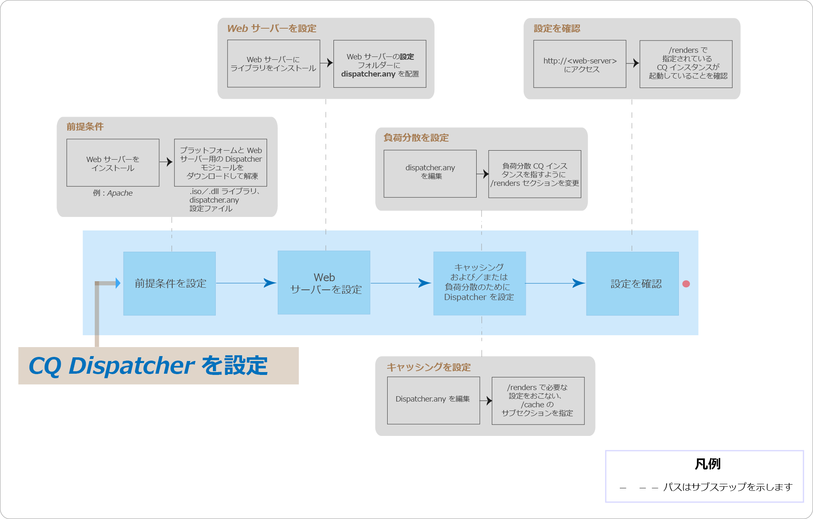

# AEMディスパッチャーのTop Issues FAQ



## 概要

### ディスパッチャーとは何ですか。

ディスパッチャーは、高速で動的なWebオーサリング環境を実現するためのAdobe Experience Managerのキャッシングおよびロードバランシングツールです。キャッシュする場合、ディスパッチャーはApacheなどのHTTPサーバーの一部として機能し、できるだけ静的なWebサイトコンテンツをできるだけ多くの静的Webサイトコンテンツとして保存（または「キャッシュ」）し、できるだけ多くの静的Webサイトのレイアウトエンジンにアクセスします。ロードバランシングロールでは、ディスパッチャーは異なるAEMインスタンス間でユーザーリクエスト（読み込み）を分散します。

キャッシュの場合、ディスパッチャーモジュールはWebサーバーの静的コンテンツを提供する機能を使用します。ディスパッチャーは、キャッシュされたドキュメントをWebサーバーのドキュメントルートに配置します。

### ディスパッチャーはどのようにキャッシュを実行しますか。

ディスパッチャーは、Webサーバーの静的コンテンツを提供する機能を使用します。ディスパッチャーは、キャッシュされたドキュメントをWebサーバーのドキュメントルートに格納します。ディスパッチャーには、Webサイトに変更が加えられたときに、キャッシュコンテンツを更新するための主に2つの方法があります。

* **コンテンツの更新** により、変更されたページと、直接関連付けられているファイルが削除されます。
* **自動的に無効化すると、更新後に期限切れになる可能性のあるキャッシュの一部が自動的** に無効になります。例えば、関連するページを、削除せずに有効なページに効果的にフラグ付けするとします。

### ロードバランシングのメリットは何ですか。

ロードバランシングは、複数のAEMインスタンスに対してユーザーリクエスト（読み込み）を振り分けます。次のリストに、ロードバランシングのメリットを示します。

* **処理能力**の向上:つまり、ディスパッチャーは、AEMの複数インスタンス間でドキュメントリクエストを共有します。各インスタンスには処理するドキュメントが少ないので、応答時間が短縮されます。ディスパッチャーは、各ドキュメントカテゴリに関する内部統計を保持するので、クエリを効率的に予測し、クエリを効率的に配布できます。
* **フェールセーフ保護の強化**:ディスパッチャーがインスタンスから応答を受け取らない場合、そのインスタンスは、他のインスタンスのいずれかに自動的にリクエストをリレーします。したがって、インスタンスが使用できなくなると、サイトが失われたときの影響が、失われた計算力に比例して行われます。

>[!NOTE]
>
>詳しくは [、ディスパッチャーの概要ページを参照してください](dispatcher.md)

## インストールと設定

### ディスパッチャーモジュールのダウンロード元はどこからですか?

最新のディスパッチャーモジュールは [、ディスパッチャーリリースノート](release-notes.md) ページからダウンロードできます。

### ディスパッチャーモジュールのインストール方法を教えてください。

「ディスパッチャー [のインストール」ページを参照してください](dispatcher-install.md)

### ディスパッチャーモジュールの設定方法を教えてください。

ディスパッチャーの [設定](dispatcher-configuration.md) ページを参照してください。

### 作成者インスタンスのディスパッチャーを設定する方法を教えてください。

詳細 [手順については、「作成者インスタンス](dispatcher.md#using-a-dispatcher-with-an-author-server) でディスパッチャーを使用する」を参照してください。

### ディスパッチャーを複数のドメインで設定する方法を教えてください。

ドメインが次の条件を満たしている場合、複数のドメインでCQディスパッチャーを設定できます。

* 両方のドメインのWebコンテンツは単一のAEMリポジトリに保存されます
* ディスパッチャーキャッシュ内のファイルは、ドメインごとに個別に無効にすることができます

詳しく [は、複数ドメイン](dispatcher-domains.md) でディスパッチャーを使用するを参照してください。

### ユーザーからのすべてのリクエストが同じ発行インスタンスにルーティングされるように、ディスパッチャーを設定するにはどうしますか。

[スティッキー接続](dispatcher-configuration.md#identifying-a-sticky-connection-folder-stickyconnectionsfor) 機能を使用すると、ユーザーのすべてのドキュメントがAEMの同じインスタンス上で処理されるようになります。この機能は、パーソナライズされたページとセッションデータを使用する場合に重要です。データはインスタンスに保存されます。そのため、同じユーザーからの後続のリクエストがそのインスタンスに戻るか、データが失われる必要があります。

スティッキー接続は、ディスパッチャーの最適化機能を制限するので、必要に応じてこの方法を使用する必要があります。「定着」ドキュメントを含むフォルダーを指定すると、そのフォルダー内のすべてのドキュメントがユーザー用に同じインスタンスで処理されるようにすることができます。

### 定着接続とキャッシュを組み合わせることはできますか。

スティッキー接続を使用するほとんどのページでは、キャッシュをオフにする必要があります。そうしないと、セッションコンテンツに関係なく、ページの同じインスタンスがすべてのユーザーに表示されます。

一部のアプリケーションでは、共通接続とキャッシュの両方を使用できます。例えば、データをセッションに書き込むフォームを表示する場合、スティッキー接続とキャッシングを組み合わせて使用できます。

### ディスパッチャーとAEM発行インスタンスは同じ物理マシンに存在するか。

マシンの性能が十分な場合は○ただし、異なるマシン上のディスパッチャーおよびAEM発行インスタンスを設定することをお勧めします。

通常、発行インスタンスはファイアウォール内に存在し、ディスパッチャーはDMZに存在します。同じ物理マシンで発行インスタンスとディスパッチャーの両方を持つように決定した場合は、ファイアウォール設定で外部ネットワークから発行インスタンスへの直接アクセスを禁止していることを確認してください。

### 特定の拡張子を持つファイルのみキャッシュできますか。

はい。例えば、GIFファイルのみをキャッシュする場合は、dispatcher. any設定ファイルのキャッシュセクションで*. gifを指定します。

### キャッシュからファイルを削除する方法を教えてください。

HTTPリクエストを使用して、キャッシュからファイルを削除できます。HTTPリクエストを受信すると、ディスパッチャーはキャッシュからファイルを削除します。ディスパッチャーは、そのページのクライアントリクエストを受信した場合にのみ、ファイルを再度キャッシュします。この方法でキャッシュされたファイルを削除することは、同じページの要求を同時に受け取らないWebサイトに適しています。

HTTPリクエストには次の構文があります。

```
POST /dispatcher/invalidate.cache HTTP/1.1
CQ-Action: Activate
CQ-Handle: path-pattern
Content-Length: 0
```

ディスパッチャーは、CQ- Handleヘッダーの値と一致する名前のキャッシュされたファイルおよびフォルダーを削除します。例えば、CQ- Handleの `/content/geomtrixx-outdoors/en` CQ- Handleは次の項目と一致します。

geometrixx- outdoorsディレクトリ内のenという名前のファイル（任意のファイル拡張子）。enディレクトリの `_jcr_content` 下に«任意のディレクトリ»（存在する場合、ページのサブノードのキャッシュされたレンダリングが含まれている場合）は、«en»というディレクトリは削除され、 `CQ-Action` «en `Delete` »また `Deactivate`は«.»の場合は削除されます。

このトピックの詳細については、「ディスパッチャーキャッシュの [手動無効化](page-invalidate.md)」を参照してください。

### 権限に依存するキャッシュを実装する方法について教えてください。

セキュアコンテンツの [キャッシュ](permissions-cache.md) ページを参照してください。

### ディスパッチャーインスタンスとCQインスタンス間の通信を保護するにはどうしますか。

[ディスパッチャーセキュリティチェックリスト](security-checklist.md) および [AEMセキュリティチェックリスト](https://helpx.adobe.com/experience-manager/6-4/sites/administering/using/security-checklist.html) ページを参照してください。

### ディスパッチャーの問題 `jcr:content` が `jcr%3acontent`

**質問**:現在、ディスパッチャーレベルで、一部のデータフォームCQリポジトリが取得され、結果セットが誤った結果セットになるよう `jcr:content``jcr%3acontent` にエンコードされたディスパッチャーレベルで、最近問題が発生しました。

**回答**: `ResourceResolver.map()` 「わかりやすい」 URLを取得して、「わかりやすい」 URLを取得し、ディスパッチャーのキャッシュの問題を解決することもできます。map（）メソッドはコロンを `:` アンダースコアにエンコードし、resolution（）メソッドはそれらをSling JCR読み取り可能形式に戻します。map（）メソッドを使用して、Ajax呼び出しで使用されるURLを生成する必要があります。

その後の読み取り: [https://sling.apache.org/documentation/the-sling-engine/mappings-for-resource-resolution.html#namespace-mangling](https://sling.apache.org/documentation/the-sling-engine/mappings-for-resource-resolution.html#namespace-mangling)

## ディスパッチャーのフラッシュ

### 発行インスタンスでディスパッチャーフラッシュエージェントを設定する方法を教えてください。

[複製](https://helpx.adobe.com/content/help/en/experience-manager/6-4/sites/deploying/using/replication.html#ConfiguringyourReplicationAgents) ページを参照してください。

### ディスパッチャーのフラッシュの問題のトラブルシューティング方法を教えてください。

[次の質問に答えるには、このトラブルシューティングの記事](https://helpx.adobe.com/content/help/en/experience-manager/kb/troubleshooting-dispatcher-flushing-issues.html) を参照してください。

* ディスパッチャーのキャッシュにコンテンツが保存されない状況をデバッグするにはどうしますか。
* キャッシュファイルが更新されない状況をデバッグするにはどうしますか。
* ディスパッチャーのフラッシュに関連しない状況をデバッグする方法を教えてください。

削除操作でディスパッチャーがフラッシュされている場合は、Sensei Martinによるこのコミュニティブログ投稿の回避策 [を使用](https://mkalugin-cq.blogspot.in/2012/04/i-have-been-working-on-following.html)してください。

### ディスパッチャーキャッシュからDAMアセットをフラッシュする方法を教えてください。

「チェーンレプリケーション」機能を使用できます。この機能を有効にすると、作成者から複製が受信されると、ディスパッチャーフラッシュエージェントによってフラッシュリクエストが送信されます。

有効にするには：

1. [次の手順に従って、公開](page-invalidate.md#invalidating-dispatcher-cache-from-a-publishing-instance) 時にエージェントをフラッシュします
1. これらのエージェントの設定に移動し、 **「トリガー」** タブで「受信 **時」** ボックスを確認します。

## その他

ディスパッチャーは、ドキュメントが最新かどうかを判断する方法を教えてください。
ドキュメントが最新の状態かどうかを判断するために、ディスパッチャーは次のアクションを実行します。

ドキュメントが自動的に無効化されるかどうかをチェックします。そうでない場合、ドキュメントは最新のものと見なされます。
ドキュメントが自動無効化用に設定されている場合、ディスパッチャーは、前回の変更を使用できるかどうかをチェックします。ドキュメントが古い場合、Dispatcher は AEM インスタンスに最新バージョンを要求し、キャッシュ内のバージョンを置き換えます。

### ディスパッチャーの返送方法はどのようにしますか。

[ディスパッチャー設定](dispatcher-configuration.md) ファイルを使用して、ディスパッチャーがドキュメントをキャッシュするかどうかを定義 `dispatcher.any`できます。Dispatcher は、要求とキャッシュ可能なドキュメントのリストとを照合します。ドキュメントがこのリストにない場合は、AEM インスタンスにドキュメントを要求します。

`/rules` このプロパティは、ドキュメントパスに従ってキャッシュされるドキュメントを制御します。`/rules` プロパティに関係なく、ディスパッチャーは次の状況でドキュメントをキャッシュしません。

* リクエストURIに疑問符 `(?)`が含まれている場合。
* 疑問符は通常、キャッシュの必要がない、検索結果などの動的ページを指します。
* ファイル拡張子が不明の場合。
* Web サーバーでドキュメントのタイプ（MIME タイプ）を判別するために、拡張子が必要です。
* 認証ヘッダー（設定可）が設定されている場合。
* AEMインスタンスが次のヘッダーを使用して応答する場合:
   * no-cache
   * no-store
   * must-revalidate

ディスパッチャーは、キャッシュされたファイルを静的Webサイトの一部としてWebサーバーに格納します。ユーザーがキャッシュされたドキュメントを要求すると、ディスパッチャーはドキュメントがWebサーバーのファイルシステムに存在するかどうかをチェックします。その場合、ディスパッチャーはドキュメントを返します。指定しない場合、ディスパッチャーはAEMインスタンスからドキュメントを要求します。

>[!NOTE]
>
>GETまたはHEAD（HTTPヘッダー）メソッドは、ディスパッチャーによってキャッシュ可能です。応答ヘッダーのキャッシュについて詳しくは、&quot;HTTP応答ヘッダーの [キャッシュ](dispatcher-configuration.md#caching-http-response-headers) 」セクションを参照してください。

### 複数のディスパッチャーを設定に実装できますか。

はい。そのような場合は、ディスパッチャーがAEM Webサイトに直接アクセスできることを確認してください。ディスパッチャーは、別のディスパッチャーからの要求を処理できません。

