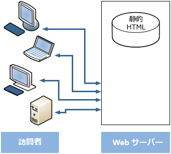
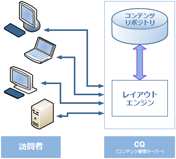
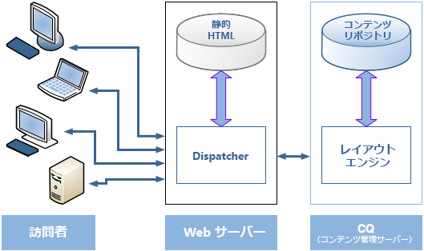
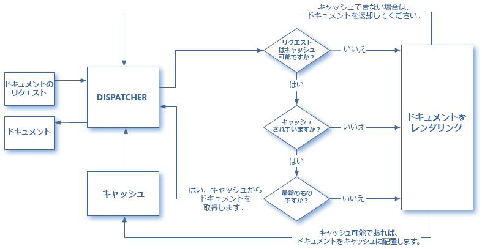
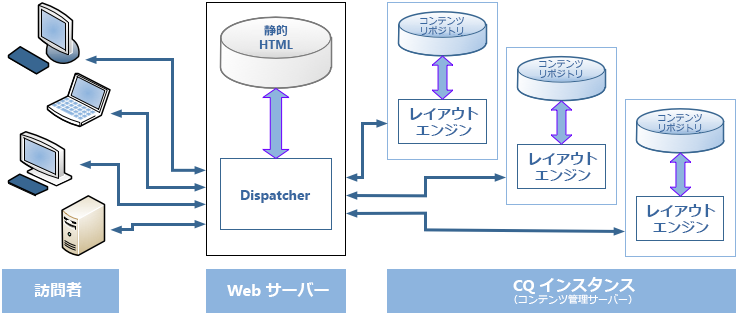

# Dispatcher の概要 {#dispatcher-overview}

>[!NOTE]
>
>Dispatcher のバージョンは AEM とは無関係です。以前のバージョンの AEM のドキュメントに組み込まれている Dispatcher のドキュメントへのリンクをたどると、このページにリダイレクトされる可能性があります。

Dispatcher は、Adobe Experience Managerのキャッシュおよびロードバランシングツールで、エンタープライズクラスの Web サーバーと共に使用されます。

Dispatcher をデプロイするプロセスは、選択した Web サーバーや OS プラットフォームとは独立しています。

1. Dispatcher について学習します（このページ）。また、 [Dispatcher に関するよくある質問 (FAQ)](https://experienceleague.adobe.com/docs/experience-manager-dispatcher/using/troubleshooting/dispatcher-faq.html?lang=en).
1. のインストール [サポート対象の web サーバー](https://experienceleague.adobe.com/docs/experience-manager-65/deploying/introduction/technical-requirements.html?lang=en) web サーバーのドキュメントに従って。
1. Web サーバーに [Dispatcher モジュールをインストール](dispatcher-install.md)し、このモジュールに合わせて Web サーバーを設定します。
1. [Dispatcher を設定](dispatcher-configuration.md)します（dispatcher.any ファイル）。
1. コンテンツの更新によってキャッシュが無効化されるように [AEM を設定](page-invalidate.md)します。

>[!NOTE]
>
>Dispatcher とAEMの連携の仕組みをより深く理解するには：
>
>* 詳しくは、 [2017 年 7 月のAEM Community Experts への質問](https://communities.adobeconnect.com/pf0gem7igw1f/).
>* アクセス [このリポジトリ](https://github.com/adobe/aem-dispatcher-experiments). 実験の集まりを「テイクホーム」ラボ形式で収蔵しています。


必要に応じて、次の情報を使用します。

* [Dispatcher のセキュリティチェックリスト](security-checklist.md)
* [Dispatcher のナレッジベース](https://helpx.adobe.com/experience-manager/kb/index/dispatcher.html)
* [Web サイトのキャッシュパフォーマンスの最適化](https://experienceleague.adobe.com/docs/experience-manager-64/deploying/configuring/configuring-performance.html?lang=en)
* [複数ドメインでの Dispatcher の使用](dispatcher-domains.md)
* [Dispatcher での SSL の使用](dispatcher-ssl.md)
* [権限に影響を受けるキャッシュの実装](permissions-cache.md)
* [Dispatcher に関する問題のトラブルシューティング](dispatcher-troubleshooting.md)
* [Dispatcher に関する主な問題とよくある質問](dispatcher-faq.md)

>[!NOTE]
>
>******Dispatcher の最も一般的な使用法は、AEM パブリッシュインスタンス**&#x200B;からの応答をキャッシュして、外部に公開されている Web サイトの応答性とセキュリティを高めることです。したがって、大部分の説明ではこのケースを想定しています。
>
>しかし、Dispatcher は&#x200B;**オーサーインスタンス**&#x200B;の応答性を高めるために使用することもできます。特に、多数のユーザーが Web サイトを編集および更新する場合には効果的です。このケースについて詳しくは、以下の[オーサリングサーバーでの Dispatcher の使用](#using-a-dispatcher-with-an-author-server)を参照してください。

## Dispatcher を使用してキャッシュを実装する理由 {#why-use-dispatcher-to-implement-caching}

Web パブリッシングには、次の 2 つの基本的な手段があります。

* **静的 Web サーバー**:Apache や IIS などは簡単ですが、処理に時間がかかります。
* **コンテンツ管理サーバー**：動的で、リアルタイムの、インテリジェントなコンテンツですが、必要とする計算時間などのリソースがはるかに多くなります。

Dispatcher によって、高速かつ動的な環境を実現できます。Dispatcher は、Apache のような静的 HTML サーバーの一部として機能し、以下の目的を達成します。

* できるだけ多くのサイトコンテンツを、静的 Web サイトの形式で格納（キャッシュ）します。
* レイアウトエンジンへのアクセスをできるだけ少なくします。

つまり、以下のようになります。

* **静的コンテンツ** は、静的 Web サーバーと同じ速度で簡単に処理できます。 また、静的 Web サーバーで使用できる管理ツールとセキュリティツールを使用することもできます。

* 必要に応じて&#x200B;**動的コンテンツ**&#x200B;を生成できます。このとき、システムの動作が必要以上に遅くなることはありません。

Dispatcher には、動的サイトのコンテンツに基づいて静的 HTML を生成および更新するメカニズムが含まれています。静的ファイルとして保存するドキュメントと、常に動的に生成するドキュメントを詳細に指定できます。

この節では、このプロセスの原則を説明します。

### 静的 Web サーバー {#static-web-server}



Apache や IIS などの静的 Web サーバーは、Web サイトの訪問者に静的 HTML ファイルを提供します。静的ページは 1 回作成されるので、リクエストごとに同じコンテンツが配信されます。

このプロセスは簡単で効率的です。 訪問者がHTMLページなどのファイルを要求した場合、そのファイルはメモリから直接取り出されます。最悪の場合は、ローカルドライブから読み取られます。 静的 Web サーバーは長い間使用可能でした。そのため、管理およびセキュリティ管理に関する様々なツールが用意されており、ネットワークインフラストラクチャと適切に統合されています。

### コンテンツ管理サーバー {#content-management-servers}



AEMなどの CMS(Content Management Server) を使用している場合、高度なレイアウトエンジンが訪問者からのリクエストを処理します。 このエンジンは、リポジトリからコンテンツを読み取り、スタイル、フォーマット、アクセス権を組み合わせて、コンテンツを訪問者のニーズや権限に合わせたドキュメントに変換します。

このワークフローを使用すると、豊富で動的なコンテンツを作成でき、Web サイトの柔軟性と機能性を高めることができます。 ただし、レイアウトエンジンは静的サーバーより多くの処理能力が必要なので、レイアウトエンジンを設定すると、多くの訪問者がシステムを使用した場合に動作が遅くなる可能性があります。

## Dispatcher によるキャッシュの実行方法 {#how-dispatcher-performs-caching}



**キャッシュディレクトリ**：キャッシュ時、Dispatcher モジュールでは Web サーバーの静的コンテンツ提供機能を使用します。キャッシュされたドキュメントは、Dispatcher によって Web サーバーのドキュメントルートに配置されます。

>[!NOTE]
>
>HTTP ヘッダーキャッシュの設定がない場合、Dispatcher は、ページの HTML コードのみを保存します。この場合、HTTP ヘッダーは保存されません。Web サイト内で異なるエンコーディングを使用している場合、これらのページが失われる可能性があるので、このシナリオは問題になる可能性があります。 HTTP ヘッダーキャッシュを有効にするには、 [Dispatcher キャッシュの設定](https://experienceleague.adobe.com/docs/experience-manager-dispatcher/using/configuring/dispatcher-configuration.html?lang=ja)

>[!NOTE]
>
>Web サーバーのドキュメントルートをネットワーク接続ストレージ（NAS）上に配置すると、パフォーマンスが低下します。また、NAS 上のドキュメントルートを複数の Web サーバー間で共有する場合、レプリケーションアクションの実行時に断続的なロックが発生することがあります。

>[!NOTE]
>
>Dispatcher は、キャッシュされたドキュメントを要求された URL と等しい構造に保存します。
>
>ファイル名の長さに関しては、OS レベルの制限が存在する場合があります。 つまり、多数のセレクターを含む URL がある場合です。

### キャッシュの方法

Web サイトに変更があったとき、Dispatcher では主に 2 つの方法でキャッシュコンテンツを更新します。

* **コンテンツの更新** 変更したページ、およびそれらに直接関連付けられているファイルを削除します。
* **自動無効化**&#x200B;によって、キャッシュで変更があった部分を自動的に無効化し、更新後に期限切れとします。つまり、関連するページに期限切れのフラグを付け、削除はおこないません。

### コンテンツの更新

コンテンツの更新では、1 つまたは複数の AEM ドキュメントが変更されます。AEM から Dispatcher にシンジケーション要求が送信され、この要求に応じて次のようにキャッシュの更新がおこなわれます。

1. 変更されたファイルをキャッシュから削除します。
1. 同じハンドルで始まるすべてのファイルを、キャッシュから削除します。たとえば、ファイル /jp/index.html が更新された場合、/jp/index で始まるすべてのファイルは削除されます。このメカニズムにより、特に画像ナビゲーションに関して、キャッシュを効率的に使用するサイトを設計できます。
1. It *タッチ* いわゆる **statfile**:statfile のタイムスタンプを更新して、最後の変更日を示します。

次のポイントに注意する必要があります。

* コンテンツの更新は、通常、何を置き換える必要があるかを「把握」するオーサリングシステムで使用されます。
* コンテンツの更新が適用されたファイルは削除されますが、すぐに置き換えられるわけではありません。次回このようなファイルが要求されると、Dispatcher はAEMインスタンスから新しいファイルを取得し、キャッシュに配置し、古いコンテンツを上書きします。
* 通常、ページのテキストを取り込んで自動生成された画像は、同じハンドルで始まる画像ファイルに格納されます。したがって、ページと画像ファイルは関連があり、削除の対象となります。例えば、mypage.html というページのタイトルテキストを、mypage.titlePicture.gif ファイルとして同じフォルダーに格納できます。したがって、ページの更新ごとにキャッシュにある画像が自動的に削除されるので、画像のバージョンを常にページの現在のバージョンと合わせることができます。
* statfile は複数持つことができます。例えば、言語フォルダーごとに 1 つずつ持つことができます。ページが更新されると、AEM は statfile を含む次の親フォルダーを探し、そのファイルに *touch* します。

### 自動無効化

自動無効化は、キャッシュのパーツを自動的に無効化するもので、ファイル自体の削除は行いません。コンテンツの更新ごとに statfile と呼ばれるファイルに touch するので、statfile のタイムスタンプは最終更新日を示します。

Dispatcher は、自動無効化の対象となるファイルのリストを保持しています。このリストにあるドキュメントが要求されると、Dispatcher はキャッシュされたドキュメントの日付と statfile のタイムスタンプを比較します。

* キャッシュされたドキュメントのほうが新しい場合、そのドキュメントを返します。
* キャッシュされたドキュメントのほうが古い場合、Dispatcher は AEM インスタンスから現在のバージョンを取得します。

この場合も、注意すべきポイントがいくつかあります。

* 自動無効化は、通常、HTMLページなど内部関係が複雑な場合に使用されます。 このようなページには、リンクやナビゲーションエントリが含まれるので、通常はコンテンツの更新後にこれらのリンクなどを更新する必要があります。PDFまたは画像ファイルが自動的に生成されている場合は、それらのファイルも自動的に無効にすることができます。
* 自動無効化は、statfile に touch する以外は、更新時の Dispatcher による操作には影響しません。 ただし、statfile への touch によって、キャッシュコンテンツは自動的に古いものとされます。キャッシュ自体は削除されません。

## Dispatcher がドキュメントを返す方法 {#how-dispatcher-returns-documents}



### ドキュメントがキャッシュの対象かどうかの判断

以下が可能です。 [設定ファイルで Dispatcher がキャッシュするドキュメントを定義する](https://experienceleague.adobe.com/docs/experience-manager-dispatcher/using/configuring/dispatcher-configuration.html?lang=ja). Dispatcher は、要求とキャッシュ可能なドキュメントのリストを照合します。ドキュメントがこのリストにない場合は、AEM インスタンスにドキュメントを要求します。

以下の場合、Dispatcher は常に AEM インスタンスに直接ドキュメントを要求します。

* リクエスト URI に疑問符「`?`&quot;. このシナリオは通常、キャッシュする必要のない、検索結果などの動的ページを示します。
* ファイル拡張子が不明の場合。Web サーバーでドキュメントのタイプ（MIME タイプ）を判別するために、拡張子が必要です。
* 認証ヘッダーは設定（設定可能）されます。

>[!NOTE]
>
>（HTTP ヘッダー用の）GET または HEAD メソッドは、Dispatcher によってキャッシュ可能です。応答ヘッダーのキャッシュについて詳しくは、[HTTP 応答ヘッダーのキャッシュ](https://experienceleague.adobe.com/docs/experience-manager-dispatcher/using/configuring/dispatcher-configuration.html?lang=ja)セクションを参照してください。

### ドキュメントがキャッシュされているかどうかの判断

Dispatcher はキャッシュされたファイルを、静的 Web サイトに含まれる場合と同様に、Web サーバー上に格納しています。ユーザーがキャッシュ可能なドキュメントを要求すると、Dispatcher はそのドキュメントが Web サーバーのファイルシステムに存在するかどうかを確認します。

* ドキュメントがキャッシュされている場合、Dispatcher はキャッシュされているファイルを返します。
* ドキュメントがキャッシュされていない場合、Dispatcher は AEM インスタンスにドキュメントを要求します。

### ドキュメントが最新かどうかの判断

ドキュメントが最新かどうかを判断するために、Dispatcher は次の 2 つの手順を実行します。

1. ドキュメントが自動無効化の対象であるかどうかチェックします。対象でない場合、ドキュメントは最新であると認識されます。
1. ドキュメントが自動無効化の対象として設定されている場合、Dispatcher は最新の変更情報と比べてドキュメントが古いかどうかチェックします。ドキュメントが古い場合、Dispatcher は AEM インスタンスに最新バージョンを要求し、キャッシュ内のバージョンを置き換えます。

>[!NOTE]
>
>を使用しないドキュメント **自動無効化** は、物理的に削除されるまでキャッシュに残ります。 例えば、Web サイト上のコンテンツの更新によって、

## ロードバランシングのメリット {#the-benefits-of-load-balancing}

ロードバランシングとは、Web サイトの計算負荷を AEM の複数のインスタンスに分散させることです。



以下のようなメリットがあります。

* **処理能力の向上**
実際には、処理能力の向上により、AEMの複数のインスタンスで Dispatcher とドキュメント要求が共有されます。 各インスタンスで処理するドキュメントの数が少なくなるので、応答時間を短縮できます。Dispatcher はドキュメントカテゴリごとに内部統計を保持するので、負荷を予測してクエリを効率的に分散させることができます。

* **フェイルセーフ対象の拡大**
インスタンスからの応答を受信しない場合、Dispatcher は自動的に要求を他のいずれかのインスタンスにリレーします。 インスタンスが使用できなくなった場合の影響は、計算能力の低下と比例してサイトの処理が遅くなることだけです。 ただし、すべてのサービスは継続します。

* 同じ静的 Web サーバー上で異なる Web サイトを管理することもできます。

>[!NOTE]
>
>ロードバランシングによって負荷を効率的に分散させる一方、キャッシュによって負荷を減らすことができます。したがって、ロードバランシングを設定する前に、キャッシュを最適化して全体の負荷を減らしてみてください。キャッシュを最適化することで、ロードバランサーのパフォーマンスを向上させたり、ロードバランシングを不要にしたりできます。

>[!CAUTION]
>
>1 つの Dispatcher で使用可能なパブリッシュインスタンスの容量を飽和させることができますが、一部のアプリケーションでは、2 つの Dispatcher インスタンス間の負荷のバランスを取るのも効果的です。 複数の Dispatcher を持つ設定は、慎重に検討する必要があります。追加の Dispatcher を使用すると、使用可能なパブリッシュインスタンスの負荷が増え、ほとんどのアプリケーションでパフォーマンスが簡単に低下する可能性があるからです。

## Dispatcher によるロードバランシングの実行方法 {#how-the-dispatcher-performs-load-balancing}

### パフォーマンスの統計

Dispatcher は、AEM の各インスタンスのドキュメント処理速度についての内部統計を保持しています。このデータに基づいて、要求に対する応答時に最も迅速な応答時間を提供できるインスタンスを予測し、そのインスタンスで必要な計算時間を予約します。

要求のタイプによって完了までの時間の平均が変わるので、Dispatcher ではドキュメントのカテゴリを指定できます。 これらのカテゴリは、推定時間の計算時に考慮されます。 例えば、通常の応答時間は異なるので、HTMLのページと画像を区別できます。

詳細検索機能を使用する場合、検索クエリ用のカテゴリを作成できます。 このメソッドは、応答が最も速いインスタンスに検索クエリを送信するのに役立ちます。 また、「高価な」検索クエリを複数受け取る場合に、低速なインスタンスが停止するのを防ぐ一方、「安い」リクエストを受け取る場合は停止を防ぐのに役立ちます。

### 個人設定されたコンテンツ（スティッキー接続）

スティッキー接続によって、1 人のユーザーに対するドキュメントが、常に AEM の同じインスタンス上で構成されます。この点は、パーソナライズされたページとセッションデータを使用する場合に重要です。 データはインスタンスに格納されるので、以降の同じユーザーからの要求は、同じインスタンスに返す必要があります。

スティッキー接続をおこなうと、Dispatcher で要求を最適化する機能が制限されるので、スティッキー接続は必要な場合にのみ使用してください。「スティッキー」ドキュメントを保存するフォルダーは指定できるので、そのフォルダー内のすべてのドキュメントをユーザーごとに同じインスタンス上で構成できます。

>[!NOTE]
>
>スティッキー接続を使用するページでは、ほとんどの場合、キャッシュをオフにする必要があります。オフにしないと、セッション内容に関わらず、ページがすべてのユーザーに同じように表示されます。
>
>*一部*&#x200B;のアプリケーションで、スティッキー接続とキャッシュの併用が可能な場合があります。例えば、セッションにデータを書き込むためのフォームを表示する場合です。

## 複数の Dispatcher の使用 {#using-multiple-dispatchers}

複雑な設定をおこなう場合は、複数の Dispatcher を使用できます。例えば、次のように使用できます。

* 1 つ目の Dispatcher を、イントラネット上での Web サイトの公開に使用
* 2 つ目の Dispatcher を、異なるアドレスと異なるセキュリティ設定で、インターネット上での同じコンテンツの公開に使用

この場合、各要求が経由する Dispatcher は 1 つだけにしてください。別の Dispatcher から渡された要求は処理されません。したがって、どちらの Dispatcher も AEM Web サイトに直接アクセスするようにしてください。

## CDN での Dispatcher の使用 {#using-dispatcher-with-a-cdn}

Akamai Edge Delivery または Amazon Cloud Front などのコンテンツ配信ネットワーク（CDN）は、エンドユーザーに近い場所からコンテンツを配信します。そのため、以下のことが可能です。

* エンドユーザーに対する応答時間をスピードアップする
* サーバーから負荷を取り除く

HTTP インフラストラクチャコンポーネントとして、CDN は Dispatcher と同様に機能します。CDN ノードがリクエストを受け取ると、可能な場合はキャッシュからリクエストを提供します（リソースはキャッシュで使用可能で、有効です）。 それ以外の場合は、次に最も近いサーバーに問い合わせてリソースを取得し、適切であれば、今後の要求に備えてキャッシュします。

「次に最も近いサーバー」は、固有の設定によって異なります。例えば、Akamai の設定では、要求は次のパスをたどることができます。

* Akamai Edge Node
* Akamai Midgres Layer
* ファイアウォール
* ロードバランサー
* Dispatcher
* AEM

通常、Dispatcher は次のサーバーで、キャッシュからドキュメントを提供し、CDN サーバーに返される応答ヘッダーに影響を与える可能性があります。

## CDN キャッシュの制御 {#controlling-a-cdn-cache}

CDN がリソースを Dispatcher から再取得するまでのキャッシュ時間を制御する方法はいくつかあります。

1. 明確な設定\
   MIME タイプ、拡張子、要求タイプなどに応じて、特定のリソースを CDN のキャッシュに保持する期間を設定します。

1. 有効期限およびキャッシュ制御ヘッダー\
   ほとんどの CDN の遵守 `Expires:` および `Cache-Control:` アップストリームサーバーによって送信された場合の HTTP ヘッダー。 この方法は、例えば、 [mod_expires](https://httpd.apache.org/docs/2.4/mod/mod_expires.html) Apache モジュール。

1. 手動での無効化\
   CDN では、Web インターフェイスを使用してリソースをキャッシュから削除できます。
1. API ベースの無効化\
   ほとんどの CDN には、リソースをキャッシュから削除できる REST または SOAP API も用意されています。

通常のAEM設定では、上記のポイント 1 と 2 で実現できる拡張機能、パス、またはその両方により、デザイン画像やクライアントライブラリなど、頻繁に変更されない使用頻度の高いリソースの適切なキャッシュ期間を設定できます。 新しいリリースがデプロイされると、一般的には手動での無効化が必要になります。

キャッシュで管理されているコンテンツに対してこの手法を使用した場合は、コンテンツの変更がエンドユーザーに表示されるのは、設定されているキャッシュ期間の有効期限が切れて、ドキュメントを再度 Dispatcher から取得したときだけです。

よりきめ細かく制御するために、API ベースの無効化を使用して、Dispatcher のキャッシュが無効化された場合に CDN のキャッシュを無効化できます。 CDN API に基づいて、独自のを実装できます [ContentBuilder](https://developer.adobe.com/experience-manager/reference-materials/6-5/javadoc/com/day/cq/replication/ContentBuilder.html) および [TransportHandler](https://developer.adobe.com/experience-manager/reference-materials/6-5/javadoc/com/day/cq/replication/TransportHandler.html) （API が REST ベースでない場合）と、これらの要素を使用して CDN のキャッシュを無効にするレプリケーションエージェントを設定します。

>[!NOTE]
>
>[AEM（CQ）Dispatcher Security and CDN+Browser Caching](https://www.slideshare.net/andrewmkhoury/dispatcher-caching-aemgemspart2jan2015) および [Dispatcher のキャッシュ](https://experienceleague.adobe.com/docs/experience-manager-gems-events/gems/gems2015/aem-dispatcher-caching-new-features-and-optimizations.html?lang=en)に関する録画済みのプレゼンテーションも参照してください。

## オーサリングサーバーでの Dispatcher の使用 {#using-a-dispatcher-with-an-author-server}

>[!CAUTION]
>
>次を使用する場合、 [タッチ UI を使用したAEM](https://experienceleague.adobe.com/docs/experience-manager-65/developing/introduction/touch-ui-concepts.html?lang=en), do **not** オーサーインスタンスのコンテンツをキャッシュします。 オーサーインスタンスに対してキャッシュが有効になっている場合は、無効にして、キャッシュディレクトリの内容を削除する必要があります。 キャッシュを無効にするには、 `author_dispatcher.any` ファイルを編集し、 `/rule` プロパティ `/cache` 節の内容は次のとおりです。

```xml
/rules
{
/0000
{ /type "deny" /glob "*"}
}
```

Dispatcher をオーサーインスタンスの前方で使用して、オーサリングのパフォーマンスを向上させることができます。オーサリング Dispatcher を設定するには、次の手順を実行します。

1. Web サーバー（Apache または IIS Web サーバー）に Dispatcher をインストールする方法については、 [Dispatcher のインストール](dispatcher-install.md)) をクリックします。
1. 新しくインストールした Dispatcher を、動作するAEMパブリッシュインスタンスとテストします。 これにより、ベースラインで正しいインストールが達成されます。
1. 今度は、Dispatcher が TCP/IP を使用してオーサーインスタンスに接続できることを確認します。
1. サンプルを置き換える `dispatcher.any` ファイルに `author_dispatcher.any` 次に示すファイル： [Dispatcher のダウンロード](release-notes.md#downloads).
1. `author_dispatcher.any` をテキストエディターで開き、以下の変更をおこないます。

   1. を `/hostname` および `/port` の `/renders` セクションで、オーサーインスタンスを指すように設定します。
   1. を `/docroot` の `/cache` セクションでキャッシュディレクトリを指すように設定します。 を使用している場合 [タッチ UI を使用したAEM](https://experienceleague.adobe.com/docs/experience-manager-65/developing/introduction/touch-ui-concepts.html?lang=en)に設定する場合は、上記の警告を参照してください。
   1. 変更内容を保存します。

1. 上記で設定した `/cache`／`/docroot` ディレクトリ内にあるすべての既存ファイルを削除します。
1. Web サーバーを再起動します。

>[!NOTE]
>
>指定された `author_dispatcher.any` 設定：以下のコンテンツに影響を与える CQ5 機能パック、ホットフィックス、またはアプリケーションコードパッケージをインストールする場合 `/libs` または `/apps`の場合は、Dispatcher キャッシュ内のこれらのディレクトリにあるキャッシュされたファイルを削除する必要があります。 これにより、次回リクエストされた際に、新しくアップグレードされたファイルが取得され、古くキャッシュされたファイルは取得されません。

>[!CAUTION]
>
>以前に設定したオーサー Dispatcher を使用し、 *Dispatcher フラッシュエージェント*、次の操作を実行します。

1. を削除または無効にします。 **オーサー Dispatcher の** AEMオーサーインスタンス上のエージェントをフラッシュしています。
1. 上記の新しい手順に従って、オーサー Dispatcher の設定をやり直します。

<!--
[Author Dispatcher configuration file (Dispatcher 4.1.2 or later)](assets/author_dispatchernew.any)
-->
<!--[!NOTE]
>
>A related knowledge base article can be found here:  
>[How to configure the dispatcher in front of an authoring environment](https://helpx.adobe.com/cq/kb/HowToConfigureDispatcherForAuthoringEnvironment.html)
-->
