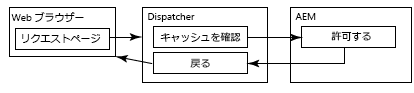
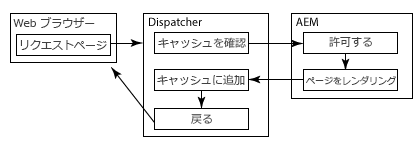
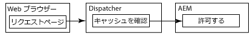

# セキュリティ保護されたコンテンツのキャッシュ {#caching-secured-content}

権限を区別するキャッシュを使用して、セキュリティ保護されたページをキャッシュできます。ディスパッチャーは、キャッシュされたページを配信する前に、ページのユーザーのアクセス権限をチェックします。

Dispatcher には、権限を区別するキャッシュを実装する AuthChecker モジュールが含まれます。このモジュールがアクティベートされると、レンダーが AEM サーブレットを呼び出して、ユーザー認証と要求されたコンテンツに対する承認を実行します。サーブレットの応答によって、コンテンツを Web ブラウザーに配信するかどうかが決定されます。

認証および承認メソッドは AEM デプロイメントに固有なので、サーブレットを作成する必要があります。

>[!NOTE]
>
>全体にセキュリティ制約を課すには、`deny` フィルターを使用します。ユーザーまたはグループのサブセットへのアクセスを許可するように設定されているページに対しては、権限を区別するキャッシュを使用します。

以下の図は、Web ブラウザーが権限を区別するキャッシュを使用するページを要求したときに発生するイベントの順序を示したものです。

## ページがキャッシュされていて、ユーザーが承認されている場合 {#page-is-cached-and-user-is-authorized}



1. Dispatcher が、要求されたコンテンツがキャッシュされていて有効であると判断します。
1. Dispatcher がレンダーに要求メッセージを送信します。HEAD セクションには、ブラウザー要求のヘッダー行がすべて含まれます。
1. レンダーがオーソライザーを呼び出してセキュリティチェックを実行し、Dispatcher に応答します。応答メッセージには、ユーザーが承認されていることを示す HTTP ステータスコード 200 が含まれます。
1. Dispatcher がブラウザーに応答メッセージを送信します。応答メッセージは、レンダーの応答のヘッダー行と、本文としてキャッシュされたコンテンツで構成されます。

## ページがキャッシュされていないが、ユーザーが承認されている場合 {#page-is-not-cached-and-user-is-authorized}



1. Dispatcher が、コンテンツがキャッシュされていない、または更新が必要であると判断します。
1. Dispatcher が、元の要求をレンダーに転送します。
1. レンダーがオーソライザーサーブレットを呼び出して、セキュリティチェックを実行します。ユーザーが承認されると、レンダーは応答メッセージの本文にレンダリングされるページを含めます。
1. Dispatcher がブラウザーに応答を転送します。Dispatcher が、レンダーの応答メッセージの本文をキャッシュに追加します。

## ユーザーが承認されていない場合 {#user-is-not-authorized}



1. Dispatcher がキャッシュを調べます。
1. Dispatcher がレンダーに要求メッセージを送信します。要求メッセージには、ブラウザーの要求のヘッダー行がすべて含まれます。
1. レンダーがオーソライザーサーブレットを呼び出してセキュリティチェックを実行し、失敗すると、元の要求を Dispatcher に転送します。

## 権限に依存するキャッシュの実装 {#implementing-permission-sensitive-caching}

権限に影響を受けるキャッシュを実装するには、以下のタスクを実行します。

* 認証と承認を実行するサーブレットを作成します。
* Dispatcher を設定します。

>[!NOTE]
>
>一般的に、安全なリソースは、安全ではないファイルとは別のフォルダーに保存します。例：/content/secure/


## 承認サーブレットの作成 {#create-the-authorization-servlet}

Web コンテンツを要求するユーザーの認証と承認を実行するサーブレットを作成し、デプロイします。このサーブレットは、AEM のユーザーアカウントとリポジトリの ACL や、LDAP 検索サービスなど、あらゆる認証および承認メソッドを使用できます。Dispatcher がレンダーとして使用する AEM インスタンスにサーブレットをデプロイします。

このサーブレットには、すべてのユーザーがアクセスできなければなりません。そのため、サーブレットは、システムへの読み取り専用アクセスを提供する `org.apache.sling.api.servlets.SlingSafeMethodsServlet` クラスを拡張する必要があります。

サーブレットは、レンダーから HEAD 要求のみを受信するので、実装する必要があるのは `doHead` メソッドだけです。

レンダーには、要求されたリソースの URI が HTTP 要求のパラメーターとして含まれます。例えば、認証サーブレットにアクセス `/bin/permissioncheck`します。/content/geometrixx-outdoors/en.html ページに対するセキュリティチェックを実行するために、レンダーは HTTP 要求に次の URL を含めます。

`/bin/permissioncheck?uri=/content/geometrixx-outdoors/en.html`

このサーブレットの応答メッセージには、次の HTTP ステータスコードを含める必要があります。

* 200：認証および承認が成功しました。

以下のサンプルサーブレットでは、要求されたリソースの URL を HTTP 要求から取得しています。このコードでは、Felix SCR の `Property` 注釈を使用して、`sling.servlet.paths` プロパティの値を /bin/permissioncheck に設定しています。`doHead` メソッドでは、サーブレットがセッションオブジェクトを取得し、`checkPermission` メソッドを使用して適切な応答コードを判断します。

>[!NOTE]
>
>sling.servlet.paths プロパティの値は、Sling Servlet Resolver（org.apache.sling.servlets.resolver.SlingServletResolver）サービスで有効にする必要があります。

### サンプルサーブレット {#example-servlet}

```java
package com.adobe.example;

import org.apache.felix.scr.annotations.Component;
import org.apache.felix.scr.annotations.Service;
import org.apache.felix.scr.annotations.Property;

import org.apache.sling.api.SlingHttpServletRequest;
import org.apache.sling.api.SlingHttpServletResponse;
import org.apache.sling.api.servlets.SlingSafeMethodsServlet;

import org.slf4j.Logger;
import org.slf4j.LoggerFactory;

import javax.jcr.Session;

@Component(metatype=false)
@Service
public class AuthcheckerServlet extends SlingSafeMethodsServlet {
 
    @Property(value="/bin/permissioncheck")
    static final String SERVLET_PATH="sling.servlet.paths";
    
    private Logger logger = LoggerFactory.getLogger(this.getClass());
    
    public void doHead(SlingHttpServletRequest request, SlingHttpServletResponse response) {
     try{ 
      //retrieve the requested URL
      String uri = request.getParameter("uri");
      //obtain the session from the request
      Session session = request.getResourceResolver().adaptTo(javax.jcr.Session.class);     
      //perform the permissions check
      try {
       session.checkPermission(uri, Session.ACTION_READ);
       logger.info("authchecker says OK");
       response.setStatus(SlingHttpServletResponse.SC_OK);
      } catch(Exception e) {
       logger.info("authchecker says READ access DENIED!");
       response.setStatus(SlingHttpServletResponse.SC_FORBIDDEN);
      }
     }catch(Exception e){
      logger.error("authchecker servlet exception: " + e.getMessage());
     }
    }
}
```

## 権限を区別するキャッシュ用の Dispatcher の設定 {#configure-dispatcher-for-permission-sensitive-caching}

dispatcher.any ファイルの auth_checker セクションで、権限を区別するキャッシュの動作を制御します。auth_checker セクションには、以下のサブセクションが含まれます。

* `url`：セキュリティチェックを実行するサーブレットの `sling.servlet.paths` プロパティの値。

* `filter`：権限を区別するキャッシュを適用するフォルダーを指定するフィルター。通常、フィルターは `deny` すべてのフォルダーに適用され、 `allow` フィルターは保護されたフォルダーに適用されます。

* `headers`：承認サーブレットが応答に含める HTTP ヘッダーを指定します。

Dispatcher が起動すると、Dispatcher のログファイルには、次のデバッグレベルのメッセージが含まれます。

`AuthChecker: initialized with URL 'configured_url'.`

以下の auth_checker セクションの例では、前のトピックのサーブレットを使用するように Dispatcher を設定しています。filter セクションは、権限チェックをセキュアな HTML リソースに対してのみ実行するようにします。

### 設定例 {#example-configuration}

```xml
/auth_checker
  {
  # request is sent to this URL with '?uri=<page>' appended
  /url "/bin/permissioncheck"
      
  # only the requested pages matching the filter section below are checked,
  # all other pages get delivered unchecked
  /filter
    {
    /0000
      {
      /glob "*"
      /type "deny"
      }
    /0001
      {
      /glob "/content/secure/*.html"
      /type "allow"
      }
    }
  # any header line returned from the auth_checker's HEAD request matching
  # the section below will be returned as well
  /headers
    {
    /0000
      {
      /glob "*"
      /type "deny"
      }
    /0001
      {
      /glob "Set-Cookie:*"
      /type "allow"
      }
    }
  }
```

